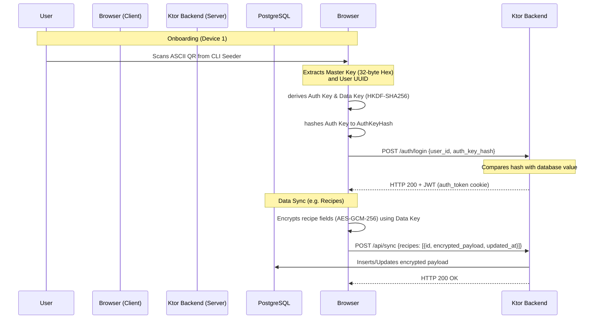
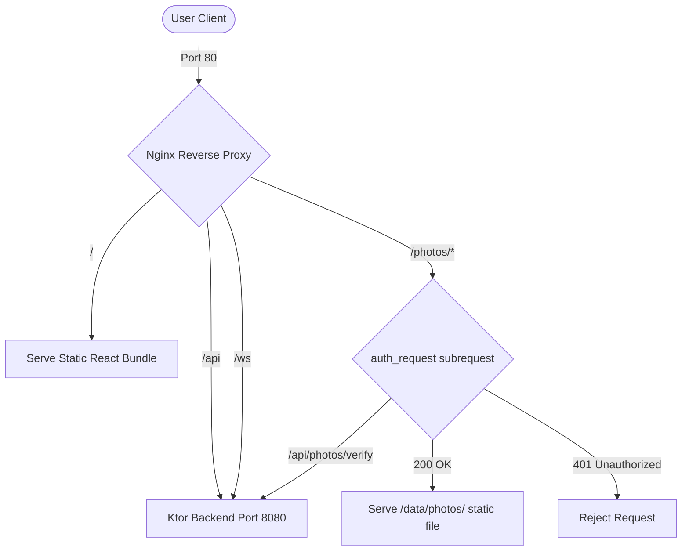

# OmniNom Implementation Walkthrough

This document outlines the codebase folder layout, deployment instructions on an Ubuntu Home Server, the End-to-End Encryption (E2EE) design, and the verification steps for the Progressive Web App (PWA).

---

## 1. Directory Structure

Below is the directory structure of the completed project workspace:

```
OmniNom/
├── .env                  <-- Created locally (copy from .env.example)
├── docker-compose.yml    <-- Database, backend, Nginx, and backup containers
├── nginx.conf            <-- Cache rules, WS upgrading, and /photos auth_request protection
├── project_blueprint_pwa.md
│
├── frontend/             <-- React 19 + TypeScript + Vite PWA frontend
│   ├── package.json
│   ├── tsconfig.json
│   ├── vite.config.ts    <-- Workbox PWA caching rules
│   ├── public/
│   │   └── manifest.webmanifest
│   └── src/
│       ├── App.tsx       <-- AuthProvider context, app routes, layouts, theme toggling
│       ├── main.tsx
│       ├── index.css     <-- Tailwind CSS v4 design tokens and CSS variables
│       ├── api/
│       │   └── apiClient.ts  <-- Fetch wrapper with retry and token-refresh logic
│       ├── components/   <-- Reusable UI elements (RecipeCard, StarRating, etc.)
│       ├── crypto/
│       │   └── cryptoEngine.ts <-- Web Crypto API client derivation and AES-GCM
│       ├── db/
│       │   └── localDb.ts <-- IndexedDB stores (idb wrapper)
│       ├── hooks/        <-- Custom queries and states (useRecipes, useInventory, etc.)
│       └── pages/        <-- Core page views (RecipesPage, CookingPage, OnboardingPage)
│
└── ktorBackend/          <-- Kotlin Ktor v3 backend
    ├── Dockerfile        <-- Multi-stage Gradle build & run container config
    ├── build.gradle.kts  <-- Server dependency manifests
    ├── scripts/
    │   ├── backup.sh      <-- Daily pg_dump backup rotate script
    │   ├── generate-qr.sh <-- Seeder QR CLI renderer wrapper
    │   └── verify-backend.sh <-- Integration testing route execution script
    └── src/main/kotlin/com/OmniNom/
        ├── Application.kt <-- Main engine Netty configurations & CORS/JWT plugins
        ├── models/
        │   └── Database.kt <-- Exposed database tables (Users, Recipes, Sync)
        ├── routes/       <-- API endpoints (Auth, Sync, Scraper, AI, Photo, WebSocket)
        └── utils/
            ├── GenerateUser.kt <-- Kotlin CLI script seeder
            └── JwtConfig.kt <-- JWT token generation helper
```

---

## 2. End-to-End Encryption (E2EE) Schema

To maintain complete privacy, all recipe content, ingredients, instructions, inventory items, and shopping lists are encrypted on the client device prior to network transfer.



### Key Derivation Details (Symmetrical implementation):
1. **Master Key**: A random 32-byte key represented as a 64-character hex string.
2. **Auth Key**: Derived locally inside the browser using the Web Crypto API, and inside the seeder using Kotlin JCE:
   - `HKDF-SHA256` with salt `"auth_v1"` and info `"OmniNom Auth"`.
3. **Data Key**: Derived locally inside the browser:
   - `HKDF-SHA256` with salt `"data_v1"` and info `"OmniNom Data"`. Used to encrypt/decrypt payloads with `AES-GCM-256`.
4. **Auth Key Hash**: Double hashing is performed to avoid exposing the auth key to the server. The `Auth Key` is hashed using `SHA-256`, yielding the `authKeyHashHex` sent during login.

---

## 3. Reverse Proxy & Static Asset Caching (Nginx)

Nginx handles static file hosting for the compiled React application, forwards WebSockets, and controls static file authorization.



### Caching Rules:
- **Index/Manifest**: Caching is disabled (`Cache-Control: no-cache, no-store, must-revalidate`) for `index.html` and `manifest.webmanifest` to ensure clients fetch code updates instantly.
- **Assets**: Build chunks (`/assets/*`) are cached aggressively for 1 year (`Cache-Control: public, max-age=31536000, immutable`) since they contain cache-busting hashes in their filenames.

---

## 4. Deployment Instructions (Ubuntu Home Server)

Follow these steps to deploy the OmniNom on your target host:

### Step 1: Clone or Copy Workspace to Server
The recommended method is using Git since the project is published in your private GitHub repository:

1. **Clone the repository on the Ubuntu server**:
   ```bash
   cd /opt
   git clone git@github.com:DEIN_USERNAME/OmniNom.git
   cd OmniNom
   ```


2. **Pull updates and rebuild**:
   Whenever you push new commits from your Windows development environment (`git push origin main`), fetch them on your server and rebuild the container stack:
   ```bash
   git pull
   docker compose up -d --build
   ```

### Step 2: Initialize Environment Variables
On your server, navigate to `/opt/OmniNom/` and copy `.env.example` to `.env`:
```bash
cd /opt/OmniNom/
cp .env.example .env
```
Open `.env` in an editor and fill in the secrets (especially `POSTGRES_PASSWORD`, `JWT_SECRET`, and `OPENROUTER_API_KEY` for AI photo scanning).

### Step 3: Run the Stack
Start the containerized stack:
```bash
docker compose up -d
```
Docker will pull the images, run a multi-stage compilation for the Ktor backend fat jar, compile/link resources, and start Postgres, Ktor, Nginx, and the Database Backup Cron job.

### Step 4: Seed the First User
Execute the user seeder script inside the running container to generate your E2EE master key:
```bash
docker exec -it OmniNom_backend java -jar /app/ktorBackend.jar generate-qr
# Alternatively, run:
# bash ktorBackend/scripts/generate-qr.sh
```
Scan the ASCII QR code printed in your terminal with your mobile device to complete onboarding!

---

## 5. Google OAuth 2.0 & E2EE Integration

To support a seamless login experience while maintaining E2EE (End-to-End Encryption) for user data, we integrated Google OAuth 2.0.

### Architecture:
1. **Frontend Authentication Flow**:
   - The user triggers Google Login via the **"Über Google anmelden"** button (`GoogleLogin` from `@react-oauth/google`).
   - On success, the Google ID Token is sent to the Ktor backend at `POST /auth/google/callback`.
   - The backend validates the ID Token using Google's tokeninfo endpoint (`https://oauth2.googleapis.com/tokeninfo`).
   - The user's email is verified against the `GOOGLE_ALLOWED_EMAILS` whitelist defined in the server's `.env`.

2. **E2EE Co-existence**:
   - For new Google-authenticated users, the server generates a random 32-byte master key (represented as a 64-character hex string).
   - This master key is encrypted on the server using `AES/GCM/NoPadding` with an encryption key derived from `JWT_SECRET` (hashed via `SHA-256`).
   - The encrypted master key is stored in the database in the `encrypted_master_key` column, and the user's `google_id` (Google Sub ID) and `email` are saved.
   - On subsequent logins, the backend decrypts `encrypted_master_key` using `JWT_SECRET` and returns it securely to the client in the callback response (`master_key_hex`).
   - The frontend decrypts local recipe data using this master key, maintaining the same E2EE pipeline as QR-code-onboarded users.

### Environment Configuration:
- **Server `.env`**:
  ```env
  GOOGLE_CLIENT_ID=your_client_id
  GOOGLE_CLIENT_SECRET=your_client_secret
  GOOGLE_ALLOWED_EMAILS=user1@gmail.com,user1@googlemail.com
  ```
- **Frontend `.env`**:
  ```env
  VITE_GOOGLE_CLIENT_ID=your_client_id
  ```

---

## 6. Verification & Testing

### Frontend Build Verification
The frontend compiler has been validated on the host system:
- **Build Command**: `npm run build` inside `frontend/`
- **Output**: Compiles successfully with zero TypeScript compilation warnings/errors:
  - Generates HTML entry point (`dist/index.html`).
  - Generates CSS styles (`dist/assets/index-*.css`).
  - Generates service worker caching files (`dist/sw.js`, `dist/workbox-*.js`).

### Backend Integration Testing
To verify backend routing, synchronization mechanisms, conflict resolutions, and Nginx auth protections on the home server, execute the verification script:
```bash
bash ktorBackend/scripts/verify-backend.sh
```

This script automates:
1. Spawning a temporary test user in the database.
2. Logging in via `/auth/login` to retrieve a JWT token.
3. Fetching sync payloads via `GET /api/sync`.
4. Writing recipe synchronization payloads via `POST /api/sync`.
5. Verifying that conflicts are caught and blocked with **HTTP 409 Conflict** if server timestamps are newer than client timestamps.
6. Verifying that the backend's local IP address filters block SSRF vulnerability requests (via `POST /api/scrape` with `127.0.0.1`).
7. Testing that Nginx cookie-based verification for the static photo folder (`/photos/*`) correctly blocks unauthorized users with a **401 Unauthorized** error.

### AI Features Verification
We have implemented and verified the following new AI capabilities:

1. **Automatic Image Scraping (Web Import)**:
   - **Endpoint**: `POST /api/scrape`
   - **Details**: Extracts the recipe's main image URL from Schema.org metadata, downloads the image on the server using Ktor Client, saves it locally to `/data/photos/`, and returns `photo_path` back to the client.
   - **Verification**: Run web import with a recipe URL containing JSON-LD metadata. Verify that the image is downloaded and displayed in the recipe editor.

2. **Recipe Photo Cropping (Book Scan)**:
   - **Endpoint**: `POST /api/recipe/from-photo`
   - **Details**: Prompts Gemini 2.5 Flash to return `imageCropCoordinates` (percentage bounding box) of the recipe photo in the scanned book page. The backend crops the uploaded image using `java.awt.image.BufferedImage` and saves it.
   - **Verification**: Scan a cookbook page containing both text and a recipe image. Check if the cropped dish image is successfully saved to `/data/photos/` and assigned as the recipe photo in the editor.

3. **AI Image Generation (Flux.2 Schnell)**:
   - **Endpoint**: `POST /api/recipe/generate-image`
   - **Details**: Uses `black-forest-labs/flux-schnell` on OpenRouter to generate a high-quality dish photo based on the recipe title and ingredients.
   - **Verification**: In `RecipeEditor.tsx`, enter a title (e.g., "Lasagne") and click **"Bild mit KI generieren"**. Check that the image is generated, saved, and loaded in the editor.

4. **AI Recipe Enrichment (Gemini 2.5 Flash)**:
   - **Endpoint**: `POST /api/recipe/enrich`
   - **Details**: Prompts Gemini 2.5 Flash to estimate prep time, portion sizes, dietary tags, and nutritional macro targets based on the recipe's current title, ingredients, and steps.
   - **Verification**: Click **"Infos mit KI ergänzen"** in the recipe editor. Verify that servings, cooking time, tags, and macros are correctly populated.

5. **AI Recipe Suggestions based on Stock (KI Rezept-Planer)**:
   - **Endpoint**: `POST /api/recipe/suggest`
   - **Details**: Prompts Gemini 2.5 Flash (`google/gemini-2.5-flash`) with decrypted inventory ingredients to generate meal ideas matching selected stock, desired days, and preference tags (e.g. "vegan", "schnell"). If "Ich gehe noch einkaufen" is toggled, it can add missing ingredients marked as `isMissing: true`.
   - **Integrations**:
     - **RecipesPage**: Triggered via **"Rezept-Vorschläge (KI)"** button.
     - **MealPlanPage**: Triggered via **"KI Wochenplaner"** button. Pre-allocates recipes across multiple days starting from the selected date.
     - **InventoryPage**: Triggered via **"Rezepte aus Vorrat generieren"** button.
   - **Verification**: Run `verify-backend.sh` on the server and check that Step 9 ("Testing AI Recipe Suggestions...") succeeds. Test on the mobile client by checkmarking stock ingredients and generating suggestions.

---

## 7. Global AI Settings & Admin Authorization

To enable dynamic selection of AI models, providers, and key management, we implemented a centralized configuration page (`/settings`).

### Key Features:
1. **Admin Authorization (`ADMIN_EMAILS`)**:
   - Confined to users configured in the backend `.env` via `ADMIN_EMAILS` (comma-separated list).
   - If empty/unset, any logged-in user can configure the AI settings.
   - Endpoint `GET /api/me` checks admin status, and frontend hides the Settings SidebarLink and mobile button for non-admins.
2. **Safe API Key Storage (AES-GCM)**:
   - Keys are encrypted in the database using Ktor backend's `MasterKeyEncryption`.
   - In `GET /api/settings/ai` requests, the keys are masked (e.g. `••••••••abcd`) to avoid leaking secrets to the browser.
3. **Dynamic Model Registry**:
   - Fetches live model listings and pricing from OpenRouter, cached in-memory for 24 hours.
   - Restricts dropdowns dynamically to vision-capable models for scanning tasks, and text-capable models for planning/enriching tasks.
   - Automatically filters out unsuitable models (e.g. base models, code models, roleplay/NSFW models).
   - Sorts models alphabetically by name.
4. **Connection Health Check**:
   - Admin can test the API key and connection to the chosen provider directly from the UI with a "Verbindung testen" button (executing a 15-second timeout text completion health-check call).
5. **New Model Notifications**:
   - Compares the loaded model list with local cache in `localStorage`. Shows a pulsing notification dot in the Sidebar if new models have been registered on OpenRouter.

### Database Table:
```kotlin
object AiSettings : Table("ai_settings") {
    val id = varchar("id", 36).default("global")
    val encryptedPayload = text("encrypted_payload")
    val updatedAt = datetime("updated_at")
    override val primaryKey = PrimaryKey(id)
}
```
